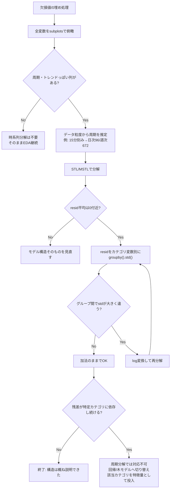

# 時系列EDA チェックリスト

高頻度・多変量の時系列データを一人で最初に触るときの標準フロー。
steel_industry.ipynb（Usage_kWh, MSTL分解）での分析を一般化したもの。

| Step | やること | 判断基準 | 次のアクション |
|---|---|---|---|
| 0 | 欠損値・0埋め処理、date型変換・インデックス化 | 0や欠損が異常値か実測かを確認 | `interpolate()`等で補完 |
| 1 | 全変数を `subplots=True` でプロット | 周期・トレンドっぽい列 vs ノイズだけの列 | 構造がある列を分析対象に選ぶ |
| 2 | データ粒度から周期の当たりをつける | 15分刻みなら日次=96, 週次=672 等 | 候補が複数 → MSTLへ |
| 3 | `STL`/`MSTL`で分解し `resid.describe()` | 平均が0からズレてないか | ズレなし→Step4、ズレあり→モデル構造を見直す |
| 4 | `resid`を**カテゴリ変数別**に `groupby().std()` | グループ間でstdが大きく違うか | 違う→乗法性を疑う(Step5)／同じ→加法のままでOK |
| 5 | `np.log(y)`で再分解、Step3-4を再チェック | グループ間のstd差が縮まったか | 改善→OK／改善せず→Step6 |
| 6 | 残った構造が周期性由来か外生要因由来か切り分け | 残差が特定カテゴリ(操業状態等)に依存し続けるか | 依存する→周期分解では原理的に無理。回帰/木モデルへ切り替え |
| 7 | 目的に応じて止め時を決める | 目的は「理解」か「予測精度」か | 理解目的なら概形が掴めた時点で終了でOK |

## 判断の核（1つだけ覚える）

**「値が大きいところほど変動の絶対量も大きくなる」データには、足し算(加法)より掛け算(乗法)モデルが合う。**
乗法はlogを通せば加法として扱える(`log(a×b) = log(a)+log(b)`)。

- 見分け方：カテゴリ別・水準別に `resid.std()` を比較して差があるかどうか
- 迷ったら：完璧な残差(ホワイトノイズ)を追い求めない。EDAの目的は「構造の当たりをつけること」であって「モデルを完璧にすること」ではない